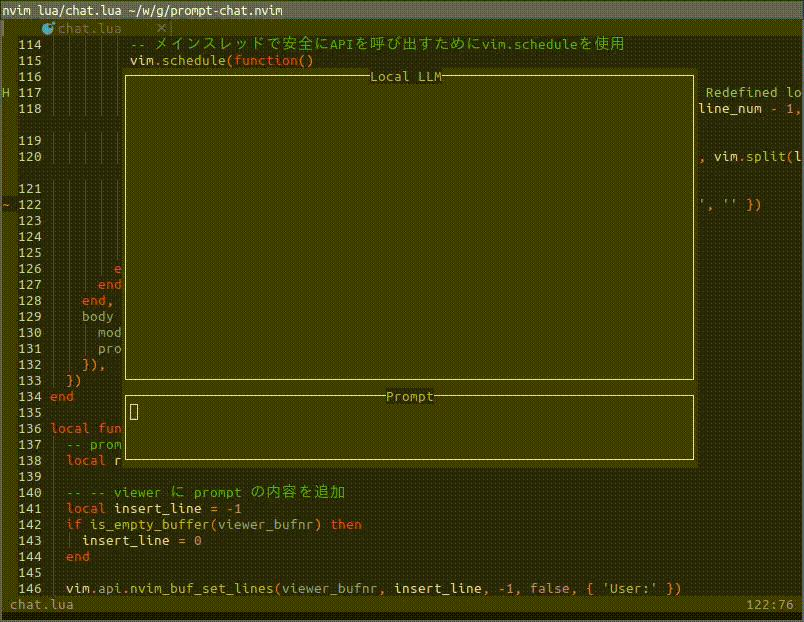

# prompt-chat.nvim



sample program using neovim floating window and `plenary.curl`

setup ollama
```bash
curl -fsSL https://ollama.com/install.sh | sh
ollama pull llama3.2
nvim lua/chat.lua

:source

# write a message and send it by ctrl-s
```
